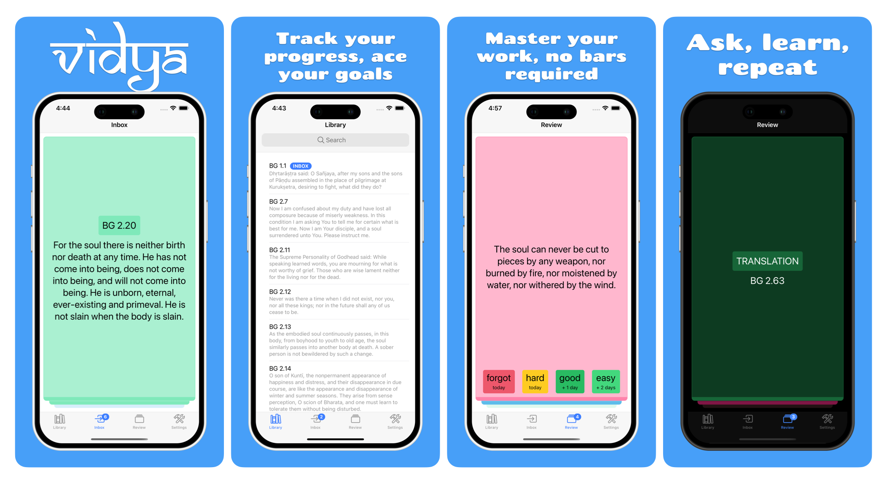

  

<i>
Vidya is a Learning Management System (LMS) crafted to revolutionize education by enabling you to establish and manage your own schools, complete with students, teachers, and more. It empowers students with the flexibility to learn anytime, anywhere through a state-of-the-art mobile application.
</i>

  
  
  

## Features

1. 🏫 **School Management Made Easy** Open and manage your own school. Invite students, onboard teachers, and handle everything from one dashboard.

2. 📚 **Course Creation** Build structured courses with lessons and homework. Organize your curriculum exactly the way you want.

3. 🌐 **Multi-Platform Access**
Students can join your school via a user-friendly website or mobile app — learning made simple and accessible.

4. 🛠️ **Your Brand, Your Domain**
Want a fully branded school on your custom domain? Need a dedicated mobile app? No problem — Vidya generates it for you automatically.

## Get involved
If you'd like to help develop the project, here's a list of links to get you started:

1. [Development Environment](<docs/Development Environment.md>) – Configure your development enviroment to get started.
2. [Good First Issues](https://github.com/akdasa-studios/vidya/issues?q=is%3Aissue+is%3Aopen+label%3A%22good+first+issue%22) – a list of simple issues any developer could start from.
3. [Roadmap](https://github.com/orgs/akdasa-studios/projects/13/views/4) - list of tasks we are working on.
