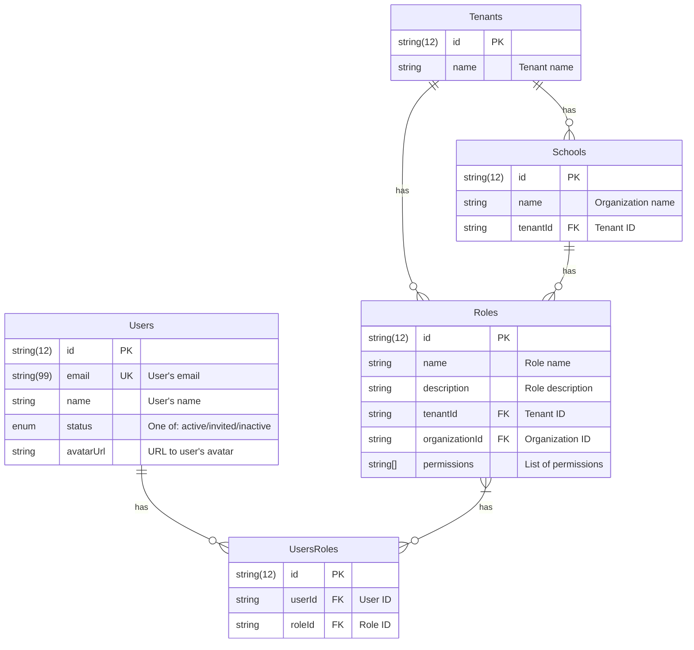
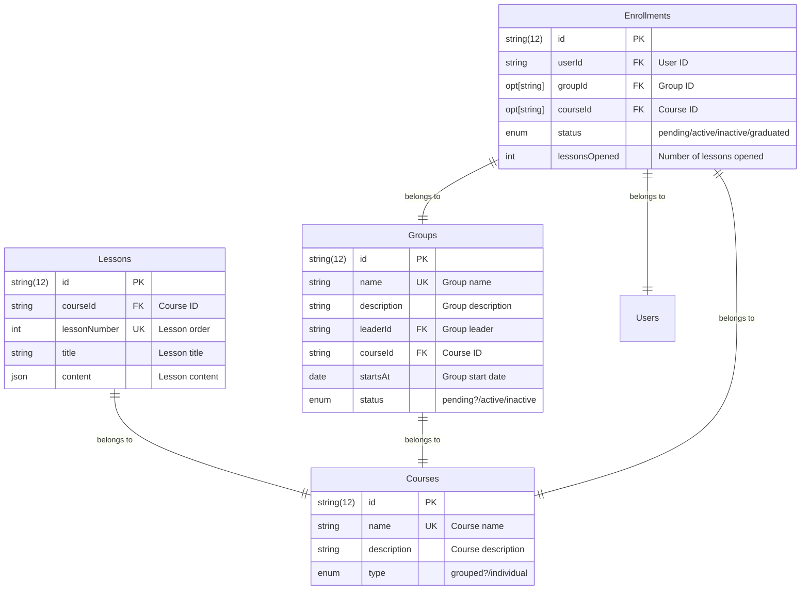

# Entity Relationship Diagram

Here are the entity relationship diagrams for the Viraha project. The diagrams are created using the [Mermaid](https://mermaid-js.github.io/mermaid/#/) library.

## Organization and Permission Management

*Tenant* is the top-level entity that represents a company or organization. Each tenant can have multiple schools. For example "Bhaktilata" and "Archana" can be two schools under the same tenant "Prabhupada School".

*School* is a sub-entity of Tenant. School belongs to one tenant. Each school can have multiple *Courses** *Groups* and so on.

*Role* is a set of permissions that can be assigned to a user. Each role can have multiple permissions, for example: "create coures", "create groups", "edit lessons" etc. Roles can be defined at the tenant level or at the school level. Roles can be assigned to users. A user can have multiple roles. For example, a user can have a "teacher" role in one school and a "student" role in another school.

*User* is a person who can log in to the system. A user can be assigned to one or more roles. A user can be a member of one or more schools. A user can have different roles in different schools.

## School Management

*Course* is a set of lessons that are grouped together. For example, "Bhagavad Gita" can be a course.

*Group* is a set of students who are studying the same course. Each *Course* can have multiple *Groups*.

*Lession* is a part of a course. Each course can have multiple lessons. For example, "Chapter 1", "Chapter 2" etc can be lessons in the "Bhagavad Gita" course. Each lesson can have a title and content.

*Enrollment* is a record that links a user to a group. Each enrollment can have a status like "active", "inactive", "graduated" etc. Each enrollment can have a number of lessons opened.

