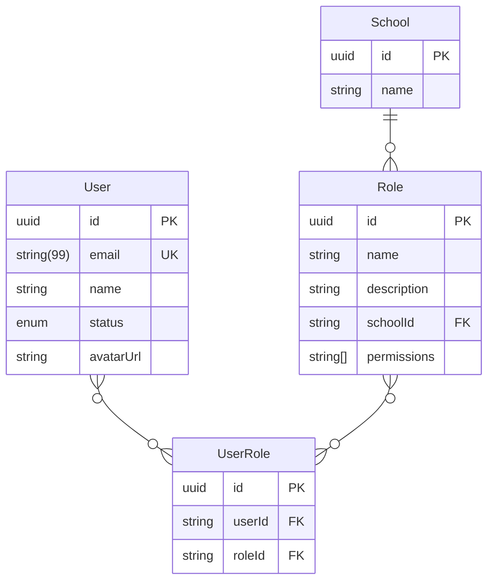
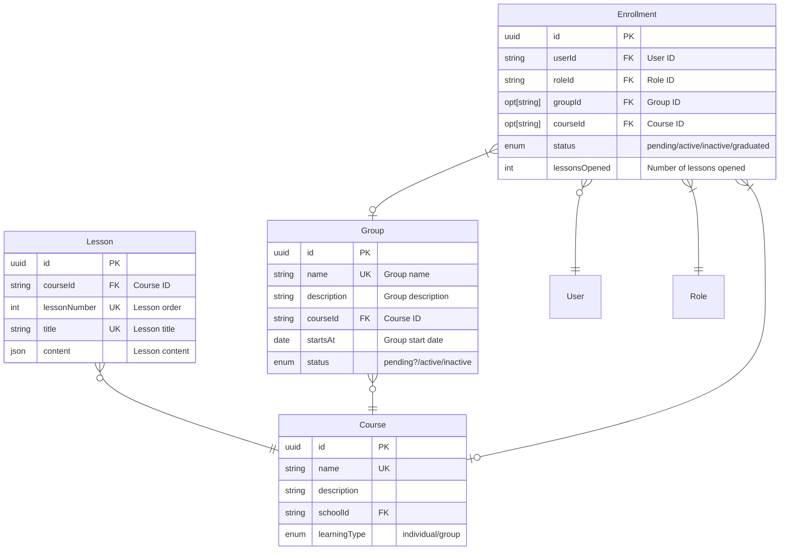

# Entity Relationship Diagram

Here are the entity relationship diagrams for the Vidya project. The diagrams are created using the [Mermaid](https://mermaid-js.github.io/mermaid/#/) library.

## School and Permission Management

*School* is the top-level entity representing an educational institution. Each school can have multiple *Courses*, *Groups*, and other related entities.

*Role* is a set of permissions that can be assigned to a user. Each role can have multiple permissions, for example: "create courses", "create groups", "edit lessons" etc. Roles can be defined at the school level. Users can have multiple roles in different schools.

*User* is a person who can log in to the system. A user can be assigned to one or more roles and can be a member of one or more schools.

## School Management

*Course* is a set of lessons that are grouped together. For example, "Bhagavad Gita" can be a course. Courses can be for individual study or group study.

*Group* is a set of students who are studying the same course. Each *Course* can have multiple *Groups*.

*Lesson* is a part of a course. Each course can have multiple lessons. For example, "Chapter 1", "Chapter 2" etc., can be lessons in the "Bhagavad Gita" course. Each lesson can have a title and content.

*Enrollment* is a record that links a user to a group and a role. Each enrollment can have a status like "active", "inactive", "graduated", etc. Each enrollment can have a number of lessons opened.

