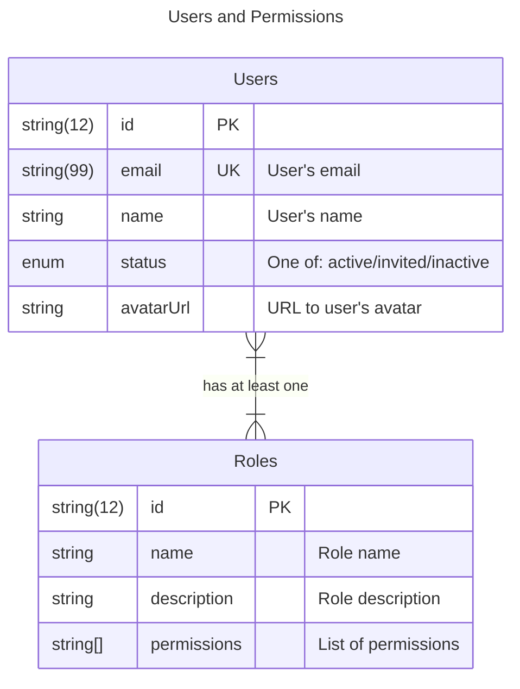
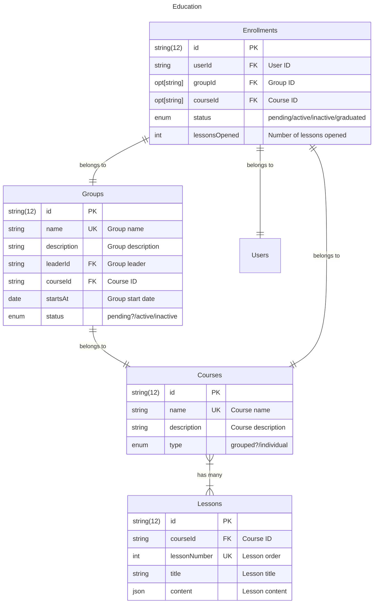

```mermaid
---
title: Users and Permissions
---
erDiagram
    Users {
        string(12) id PK
        string(99) email UK "User's email"
        string name "User's name"
        enum status "One of: active/invited/inactive"
        string avatarUrl "URL to user's avatar"
    }

    Roles {
        string(12) id PK
        string name "Role name"
        string description "Role description"
        string[] permissions "List of permissions"
    }

    Users }|--|{ Roles : "has at least one"
```

```mermaid
---
title: Education
---
erDiagram
    Courses {
        string(12) id PK
        string name UK "Course name"
        string description "Course description"
        enum type "grouped?/individual"
    }

    Groups {
        string(12) id PK
        string name UK "Group name"
        string description "Group description"
        string leaderId FK "Group leader"
        string courseId FK "Course ID"
        date startsAt "Group start date"
        enum status "pending?/active/inactive"
    }

    Enrollments {
        string(12) id PK
        string userId FK "User ID"
        opt[string] groupId FK "Group ID"
        opt[string] courseId FK "Course ID"
        enum status "pending/active/inactive/graduated"
        int lessonsOpened "Number of lessons opened"
    }

    Lessons {
        string(12) id PK
        string courseId FK "Course ID"
        int lessonNumber UK "Lesson order"
        string title "Lesson title"
        json content "Lesson content"
    }

    Courses }|--|{ Lessons : "has many"
    Groups ||--|| Courses : "belongs to"
    Enrollments ||--|| Users : "belongs to"
    Enrollments ||--|| Groups : "belongs to"
    Enrollments ||--|| Courses : "belongs to"
```
