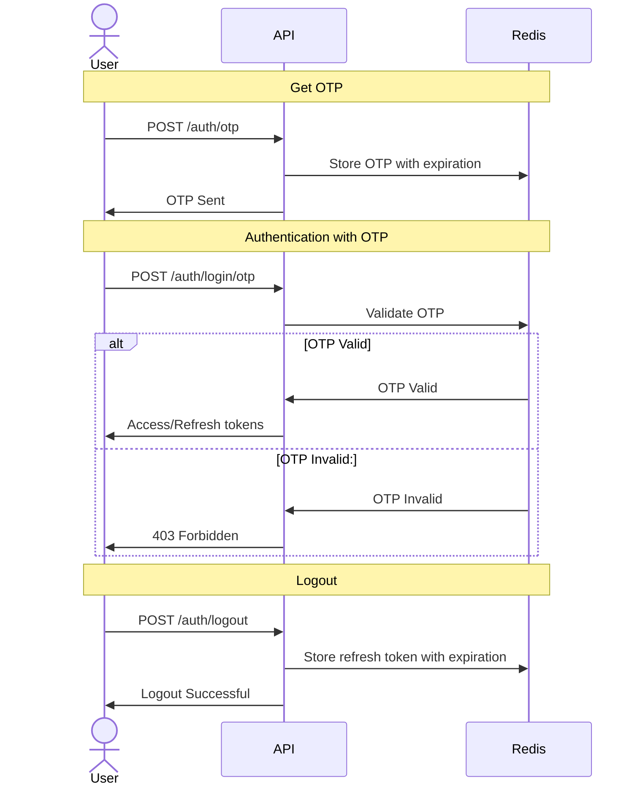
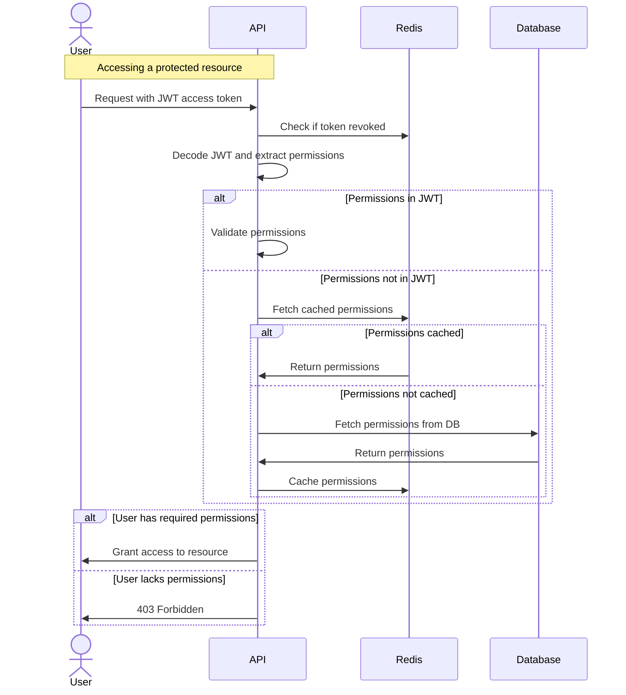

# ADR 001: Authentication and Authorization

We need a secure and scalable authentication mechanism for our application. To facilitate this, we have decided to use JSON Web Token (JWT) authentication with a one-time password (OTP) mechanism.

## Decision

We will implement JWT authentication using OTP as follows:

1. **OTP Generation Endpoint:**

   - `POST /auth/otp` will generate a one-time password and send it to the user via a pre-configured delivery method (e.g., email or SMS).
   - The endpoint requires the user’s identifier (e.g., email or phone number).
   - The OTP will have a short expiration time (e.g., 5 minutes) and will be stored in Redis with an expiration time.
   - A user cannot generate a new OTP if a previously generated OTP still exists in Redis. This restriction prevents abuse of OTP generation.

2. **OTP Authentication Endpoint:**

   - `POST /auth/login/otp` will accept the user identifier and OTP.
   - If valid, it will return a JWT access token and a refresh token.
   - If invalid or expired, authentication will fail.

3. **JWT Structure:**

   - The access token will be a short-lived JWT (e.g., 15 minutes).
   - The refresh token will have a longer lifespan (e.g., 7 days) and can be used to obtain a new access token.
   - The JWT payload will contain:
     - `sub` (user identifier)
     - `iat` (issued at timestamp)
     - `exp` (expiration timestamp)
     - `jti` (token id, to identify revoked tokens)
     - `permissions` (optional, list of permissions)
   - If no `permissions` are provided in the JWT, the system will fetch the user's permissions from the database during token validation. These permissions will be cached in Redis.

4. **Security Considerations:**

   - OTPs will be stored securely in Redis with an expiration time and have a one-time use policy.
   - JWTs will be signed using a secure algorithm (e.g., RS256 or HS256).
   - Refresh tokens will be stored in Redis upon user logout to prevent reuse after logout.
   - Rate limiting will be applied to OTP requests to prevent abuse.
   - Permissions retrieved from the database will be cached appropriately to avoid excessive database queries, while ensuring updates to permissions are reflected in a timely manner.
  
## Authentication Flow

## Authorization Flow

## Consequences

- **Pros:**

  - Stateless authentication enables scalability.
  - Secure OTP authentication enhances user security.
  - JWTs can be easily used across different services.

- **Cons:**

  - Requires secure storage and handling of refresh tokens.
  - OTP-based authentication may introduce slight delays due to external services (e.g., SMS delivery).

## Alternatives Considered

1. **Session-Based Authentication:**

   - Rejected because it requires storing sessions etc. and is more difficult to implement than the JWT-only approach.

2. **Password-Based Authentication:**

   - Rejected because this mechanism is outdated and requires a lot of implementation, such as password change, password restoration, and secure storage.

## Conclusion

JWT authentication with OTP provides a balance between security, scalability, and usability. The addition of optional permissions in the JWT, with fallback to database-stored permissions, ensures flexibility and efficiency in handling authorization. We will proceed with this approach, implementing proper security measures to mitigate risks.
